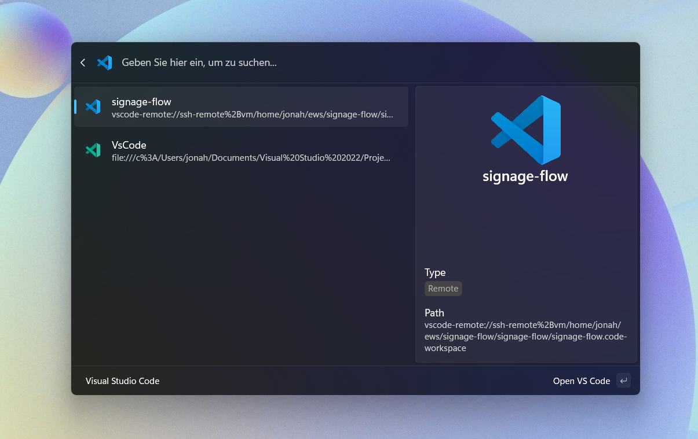

# Command Palette for Visual Studio Code

## Overview

This project provides a command palette extension for opening Visual Studio Code workspaces.

## Features

- **Workspace Management**: Retrieve and display a list of available workspaces, including their paths and types (e.g., Local, WSL, Remote).
- **Command Execution**: Open workspaces in Visual Studio Code using a dedicated command.
- **Multi-Installation Support**: Works for multiple installations of Visual Studio Code, including Insider and system installations.

## Installation

### Windows Store

### Manual Installation

1. Make sure you use the latest version of PowerToys.
2. Download the current Version and the certificate from [releases](https://github.com/JonahFintzDev/CommandPaletteVSCode/releases/).
3. Install the application by double-clicking the `.msix` file.

## Contributing

Contributions are welcome! If you have suggestions for improvements or new features, please open an issue or submit a pull request.
