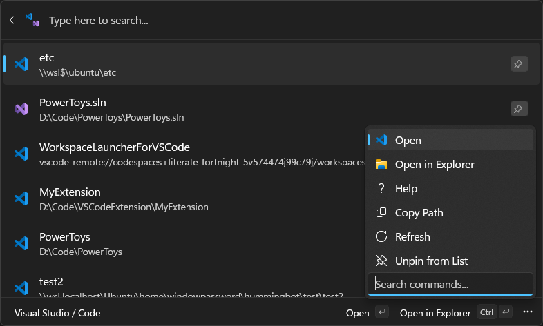
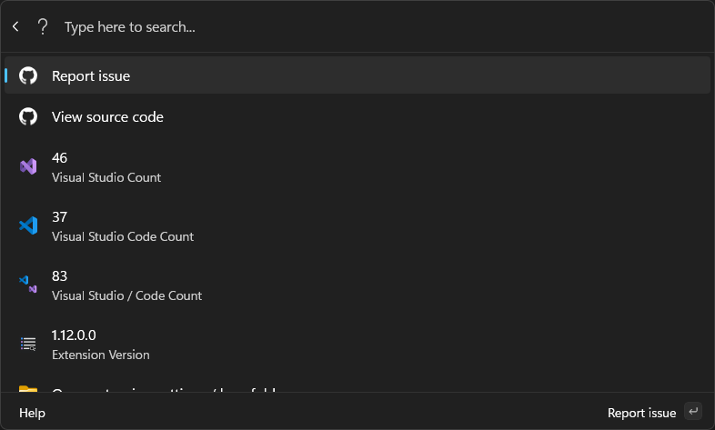

# Workspace Launcher for Visual Studio / Code

## Overview

This project provides a command palette extension for opening Visual Studio solutions and Visual Studio Code workspaces from a single, unified interface.



## Features

- **Unified Launcher**: Launch both Visual Studio solutions and Visual Studio Code workspaces from a single, convenient interface.
- **Window-Switching**: If a Visual Studio solution is already open, the extension will switch to the existing window instead of opening a new instance.
- **Workspace Management**: Retrieve and display a list of available workspaces, including their paths and types (e.g., Local, WSL, Remote).
- **Command Execution**: Open solutions in Visual Studio and workspaces in Visual Studio Code using dedicated commands.
- **Multi-Installation Support**: Works for multiple installations of Visual Studio and Visual Studio Code, including Insider and system installations.
- **Secondary Actions**: Access additional commands for each entry:
    - **Copy Path**: Copies the full file path of the solution, workspace, or folder to the clipboard.
    - **Remove from List**: Removes the workspace entry from Visual Studio Code's list of recently opened projects (not available for Visual Studio solutions).
    - **Open in Explorer**: Opens the solution, workspace, or folder location in the default file explorer.
    - **Refresh Workspaces**: Manually reloads the list of solutions and workspaces to reflect any recent changes.

## Installation

> [!NOTE]  
> Because the application is first signed by the Microsoft Store, updates will take a few days to be available via WinGet or in the Command Palette.

### Windows Store

<a href="https://apps.microsoft.com/detail/9mvlfk6tr4d4?mode=direct">
	
</a>

### Via Command Palette

1. Open Command Palette
2. Select "Workspace Launcher for Visual Studio / Code"

<!-- ### Via Winget

1. Open Command Prompt or PowerShell
2. Run the following command:
   ```bash
   winget install 15722UsefulApp.WorkspaceLauncherForVSCode
   ```
-->

### Manual Installation

1. Make sure you use the latest version of PowerToys.
2. Install the application by double-clicking the `.msix` file.

## Replacing PowerToys Run
Suggested usage to replace PowerToys Run with this extension:

1. Open the Command Palette settings > Extensions > Workspace Launcher for Visual Studio / Code.
2. Assign **Alt + Space** as the global hotkey (requires disabling PowerToys Run) or assign `{` as an alias with Direct toggled.



## Settings

- **Preferred Edition**: Determines which edition (Default or Insider) is used when a folder or workspace has been opened in both editions of Visual Studio Code.
- **Search By**: Choose what to search by (Path, Title, or Both).
- **Use Strict Search**: Enables or disables strict search for workspaces.
- **Page Size**: Sets the number of items to load and display at one time.
- **Show Details Panel**: Toggles the visibility of the details panel.
- **Tags**: Configures the tags displayed for each workspace (Type, Target, or both).
- **Enable Visual Studio Code Installations**: Toggles which installations of Visual Studio Code to search for workspaces.
- **Command Result Action**: Determines what should happen after opening a Visual Studio Code workspace.

## How It Works

This extension discovers installations of Visual Studio and Visual Studio Code on your system.
- For **Visual Studio Code**, it reads the workspace history from the internal storage files (`state.vscdb` and `storage.json`).
- For **Visual Studio**, it uses `vswhere.exe` to find installations and then reads their configuration files to discover recent solutions.
- The extension also includes logic from the **WindowWalker** extension to detect if a solution is already open. If so, it switches to the existing Visual Studio window instead of creating a new one.

The results are then combined into a single, unified list for easy access.

For more detailed technical information about the project's architecture and components, please see the [Project Guide](./GUIDE.md).

## Contributing

Contributions are welcome! If you have suggestions for improvements or new features, please open an issue or submit a pull request.
